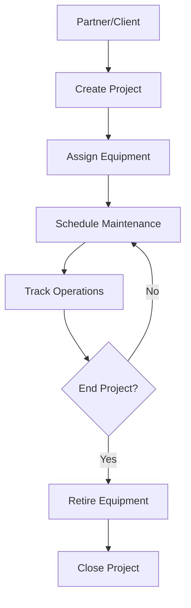

Mantis is a Django-based project and equipment management system designed for water treatment and sanitation services. The system manages equipment rental, project assignments, maintenance scheduling, and client relationships.

## Technology Stack

<CardGroup cols={2}>
  <Card title="Backend" icon="python">
    - Django ORM for data models
    - PostgreSQL database
    - RESTful API architecture
  </Card>
  <Card title="Core Features" icon="gear">
    - Equipment lifecycle management
    - Project resource allocation
    - Maintenance scheduling
    - Historical audit trails
  </Card>
</CardGroup>

## Data Model Overview

The system is built around four primary domains:

### Core Entities

<AccordionGroup>
  <Accordion title="Projects" icon="folder-open">
    Projects represent client engagements with assigned equipment and resources.
    
    **Key Relationships:**
    - Belongs to a `Partner` (client)
    - Contains multiple `ProjectResourceItem` assignments
    - Tracks location, dates, and contact information
  </Accordion>

  <Accordion title="Equipment" icon="toolbox">
    Equipment and services available for rental and assignment to projects.
    
    **Key Types:**
    - Sanitary batteries (men/women)
    - Washstands (LVMNOS)
    - Treatment plants (water/wastewater)
    - Storage tanks
    - Services
  </Accordion>

  <Accordion title="Partners" icon="building">
    Clients who contract projects and receive invoices.
    
    **Attributes:**
    - Business tax ID (RUC)
    - Contact information
    - Billing address
  </Accordion>

  <Accordion title="Users" icon="users">
    System users with role-based access and permissions.
    
    **Roles:**
    - `ADMINISTRATIVO` - Administrative users
    - `TECNICO` - Technical users
  </Accordion>
</AccordionGroup>

## Base Model Pattern

All models inherit from `BaseModel`, which provides:

<CodeGroup>
```python Common Fields
created_at: DateTime      # Auto-set on creation
updated_at: DateTime      # Auto-updated on save
is_active: Boolean        # Active/inactive flag
is_deleted: Boolean       # Soft delete flag
id_user_created: Integer  # Creator user ID
id_user_updated: Integer  # Last updater user ID
notes: Text              # Optional notes
```
</CodeGroup>

<Info>
Mantis uses **soft deletes** via the `is_deleted` flag. Records are never physically removed to preserve audit history.
</Info>

## Historical Tracking

The system uses `django-simple-history` to maintain complete audit trails:

- All model changes are tracked
- Historical snapshots preserve field values
- Change reasons can be documented
- Full audit log for compliance

## Design Principles

<CardGroup cols={2}>
  <Card title="Data Integrity" icon="shield">
    Foreign keys use `PROTECT` to prevent accidental deletion of referenced records.
  </Card>
  
  <Card title="Audit Trail" icon="clock-rotate-left">
    All changes are logged with user and timestamp information for compliance.
  </Card>
  
  <Card title="Soft Deletes" icon="trash-can-undo">
    Records are marked deleted, never physically removed, preserving history.
  </Card>
  
  <Card title="Incremental IDs" icon="hashtag">
    AutoField primary keys for predictable, sequential identifiers.
  </Card>
</CardGroup>

## System Workflow



## Next Steps

<CardGroup cols={2}>
  <Card title="Projects" icon="folder" href="/core-concepts/projects">
    Learn about project lifecycle and management
  </Card>
  <Card title="Equipment" icon="toolbox" href="/core-concepts/equipment">
    Explore equipment types and resource management
  </Card>
  <Card title="Users & Roles" icon="users" href="/core-concepts/users-roles">
    Understand user permissions and roles
  </Card>
  <Card title="API Reference" icon="code" href="/api/introduction">
    Browse the API documentation
  </Card>
</CardGroup>