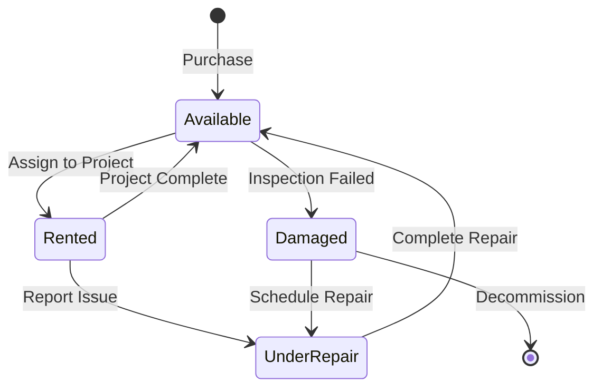

The `ResourceItem` model represents both physical equipment and services that can be assigned to projects. Mantis supports specialized equipment for water treatment, sanitation, and related services.

## Equipment Types

Mantis manages the following equipment types via the `type_equipment` field:

<CardGroup cols={2}>
  <Card title="SERVIC" icon="bell-concierge">
    **Services**
    
    Non-physical service offerings
  </Card>
  
  <Card title="LVMNOS" icon="sink">
    **Washstands**
    
    Portable handwashing stations with foot pumps and dispensers
  </Card>
  
  <Card title="BTSNHM" icon="restroom">
    **Men's Sanitary Battery**
    
    Portable bathroom facilities for men, including urinals
  </Card>
  
  <Card title="BTSNMJ" icon="restroom">
    **Women's Sanitary Battery**
    
    Portable bathroom facilities for women
  </Card>
  
  <Card title="EST4UR" icon="toilet">
    **Quad Urinal Station**
    
    Four-unit urinal station
  </Card>
  
  <Card title="CMPRBN" icon="caravan">
    **Camper Bathroom**
    
    Mobile bathroom unit
  </Card>
  
  <Card title="PTRTAP" icon="water">
    **Potable Water Treatment Plant**
    
    Equipment for treating and purifying drinking water
  </Card>
  
  <Card title="PTRTAR" icon="droplet">
    **Wastewater Treatment Plant**
    
    Equipment for treating wastewater and sewage
  </Card>
  
  <Card title="TNQAAC" icon="barrel">
    **Raw Water Storage Tanks**
    
    Tanks for storing untreated water
  </Card>
  
  <Card title="TNQAAR" icon="barrel">
    **Wastewater Storage Tanks**
    
    Tanks for storing wastewater
  </Card>
</CardGroup>

## Core Resource Fields

### Identification

<ParamField path="id" type="integer" required>
  Auto-incrementing primary key
</ParamField>

<ParamField path="name" type="string" required>
  Equipment or service name (max 255 characters)
</ParamField>

<ParamField path="code" type="string" unique>
  Unique code identifier for the equipment/service (max 50 characters)
</ParamField>

<ParamField path="type_equipment" type="string" default="null">
  Equipment subtype from the list above
  
  - Null for services
  - Required for physical equipment
</ParamField>

### Physical Specifications

<ParamField path="brand" type="string" default="null">
  Manufacturer brand (max 255 characters)
</ParamField>

<ParamField path="model" type="string" default="N/A">
  Equipment model (max 255 characters)
</ParamField>

<ParamField path="serial_number" type="string" default="null">
  Manufacturer serial number (max 255 characters)
</ParamField>

<ParamField path="date_purchase" type="date" default="null">
  Date of purchase
</ParamField>

### Dimensions

<ParamField path="height" type="integer" default="null">
  Height in centimeters
</ParamField>

<ParamField path="width" type="integer" default="null">
  Width in centimeters
</ParamField>

<ParamField path="depth" type="integer" default="null">
  Depth in centimeters
</ParamField>

<ParamField path="weight" type="integer" default="null">
  Weight in kilograms
</ParamField>

<ParamField path="capacity_gallons" type="decimal" default="null">
  Capacity in gallons
  
  - Max digits: 10
  - Decimal places: 2
</ParamField>

<ParamField path="plant_capacity" type="string" default="null">
  Specific capacity rating for treatment plants (max 255 characters)
</ParamField>

## Equipment Status Tracking

Every resource has status fields prefixed with `stst_` for tracking current state.

### Equipment Condition

<ParamField path="stst_status_equipment" type="string" default="FUNCIONANDO">
  Current operational status
  
  **Choices:**
  - `FUNCIONANDO` - Functioning
  - `DAÑADO` - Damaged
  - `INCOMPLETO` - Incomplete
  - `EN REPARACION` - Under repair
</ParamField>

<ParamField path="stst_repair_reason" type="text" default="null">
  Explanation when status is `EN REPARACION`
</ParamField>

### Availability

<ParamField path="stst_status_disponibility" type="string" default="DISPONIBLE">
  Rental availability status
  
  **Choices:**
  - `DISPONIBLE` - Available for rental
  - `RENTADO` - Currently rented
</ParamField>

### Location & Assignment

<ParamField path="stst_current_location" type="string" default="null">
  Current physical location of the equipment (max 255 characters)
</ParamField>

<ParamField path="stst_current_project_id" type="integer" default="null">
  ID of the project currently using this equipment
</ParamField>

<ParamField path="stst_commitment_date" type="date" default="null">
  Date when equipment was committed to current project
</ParamField>

<ParamField path="stst_release_date" type="date" default="null">
  Expected or actual release date from current project
</ParamField>

## Component Features

Different equipment types have specific boolean fields to track included components.

### Sanitary Equipment Components

<AccordionGroup>
  <Accordion title="Washstand Components (LVMNOS)" icon="sink">
    - `have_foot_pumps` - Foot-operated water pumps
    - `have_soap_dispenser` - Soap dispenser
    - `have_napkin_dispenser` - Napkin dispenser
    - `have_paper_towels` - Paper towel holder
  </Accordion>
  
  <Accordion title="Sanitary Battery Components (BTSNHM, BTSNMJ)" icon="restroom">
    - `have_paper_dispenser` - Toilet paper dispenser
    - `have_soap_dispenser` - Soap dispenser
    - `have_napkin_dispenser` - Napkin dispenser
    - `have_urinals` - Urinals (men's only)
    - `have_seat` - Toilet seat
    - `have_toilet_pump` - Toilet pump
    - `have_sink_pump` - Sink pump
    - `have_toilet_lid` - Toilet lid/cover
    - `have_bathroom_bases` - Bathroom bases
    - `have_ventilation_pipe` - Ventilation pipe
  </Accordion>
</AccordionGroup>

### Treatment Plant Components

<AccordionGroup>
  <Accordion title="Engine & Motor Components" icon="engine">
    **Motor Specifications:**
    - `engine_fases` - Motor phases (`1`, `2`, or `3` phases)
    - `engine_brand` - Motor manufacturer
    - `engine_model` - Motor model
    - `have_engine` - Has motor
    - `have_engine_guard` - Has motor guard
    - `engine_guard_brand` - Guard brand
    - `engine_guard_model` - Guard model
    
    **Relays:**
    - `have_relay_engine` - Has motor relay
    - `have_relay_blower` - Has blower relay
    - `relay_engine` - Motor relay brand
    - `relay_blower` - Blower relay brand
  </Accordion>
  
  <Accordion title="Blower System" icon="wind">
    - `have_blower_brand` - Has blower
    - `blower_brand` - Blower manufacturer
    - `blower_model` - Blower model
    - `have_belt_brand` - Has belt
    - `belt_brand` - Belt brand
    - `belt_model` - Belt model
    - `belt_type` - Belt type (`A` or `B`)
    - `have_blower_pulley` - Has blower pulley
    - `blower_pulley_brand` - Blower pulley brand
    - `blower_pulley_model` - Blower pulley model
    - `have_motor_pulley` - Has motor pulley
    - `motor_pulley_brand` - Motor pulley brand
    - `motor_pulley_model` - Motor pulley model
  </Accordion>
  
  <Accordion title="Electrical Components" icon="bolt">
    - `have_electrical_panel` - Has electrical panel
    - `electrical_panel_brand` - Panel brand
    - `electrical_panel_model` - Panel model
    - `have_motor_guard` - Has motor guard (circuit breaker)
  </Accordion>
  
  <Accordion title="Pumps & Filters" icon="filter">
    **Pumps:**
    - `have_pump_filter` - Has filter pump
    - `pump_filter` - Filter pump specification
    - `have_pump_pressure` - Has pressure pump
    - `pump_pressure` - Pressure pump specification
    - `have_pump_dosing` - Has dosing pump
    - `pump_dosing` - Dosing pump specification
    
    **Filters (PTRTAP only):**
    - `have_uv_filter` - Has UV filter
    - `uv_filter` - UV filter specification
    - `have_sand_carbon_filter` - Has sand/carbon filter
    - `sand_carbon_filter` - Sand/carbon filter specification
    
    **Tanks:**
    - `have_hidroneumatic_tank` - Has hydropneumatic tank
    - `hidroneumatic_tank` - Tank specification
  </Accordion>
</AccordionGroup>

## Images

<ParamField path="resource_image" type="image" default="null">
  Primary image of the equipment
  
  Upload path: `equipment/resource_items/images/`
</ParamField>

<ParamField path="resource_image_2" type="image" default="null">
  Secondary image of the equipment
  
  Upload path: `equipment/resource_items/images/`
</ParamField>

## Field Organization

The `ResourceItem` model uses a sophisticated field organization system:

### Field Categories

<Tabs>
  <Tab title="Common Fields">
    Fields shared across all equipment types:
    - `id`, `name`, `code`
    - `brand`, `model`, `serial_number`
    - `date_purchase`
    - `height`, `width`, `depth`, `weight`
    - `capacity_gallons`
  </Tab>
  
  <Tab title="Specific Fields">
    Fields unique to certain equipment types (e.g., `have_urinals` only for men's bathrooms)
  </Tab>
  
  <Tab title="State Fields (stst_*)">
    Current status and location tracking fields:
    - `stst_status_equipment`
    - `stst_status_disponibility`
    - `stst_current_location`
    - `stst_current_project_id`
    - `stst_commitment_date`
    - `stst_release_date`
    - `stst_repair_reason`
  </Tab>
  
  <Tab title="Metadata Fields">
    Inherited from `BaseModel`:
    - `created_at`, `updated_at`
    - `is_active`, `is_deleted`
    - `id_user_created`, `id_user_updated`
    - `notes`
  </Tab>
</Tabs>

## Model Properties

The `ResourceItem` model includes several properties for field organization:

<ResponseField name="all_fields_for_type" type="property">
  Returns applicable fields for the equipment type
</ResponseField>

<ResponseField name="common_fields" type="property">
  Returns fields common to all equipment types
</ResponseField>

<ResponseField name="specific_fields" type="property">
  Returns fields specific to this equipment type
</ResponseField>

<ResponseField name="state_fields" type="property">
  Returns all `stst_*` status tracking fields
</ResponseField>

<ResponseField name="boolean_fields" type="property">
  Returns all boolean component tracking fields (e.g., `have_*`)
</ResponseField>

## Model Methods

<ResponseField name="get_by_code" type="classmethod">
  Retrieve equipment by unique code
  
  ```python
  equipment = ResourceItem.get_by_code('WASH-001')
  ```
</ResponseField>

<ResponseField name="get_field_value" type="method">
  Safely get field value by name, with choice display support
  
  ```python
  status = equipment.get_field_value('stst_status_equipment')
  ```
</ResponseField>

<ResponseField name="get_field_label" type="method">
  Get human-readable label for a field
  
  ```python
  label = equipment.get_field_label('stst_status_equipment')
  # Returns: "Estado técnico"
  ```
</ResponseField>

## Equipment Workflow



<Info>
Equipment inherits all fields from `BaseModel`, including audit trail and soft delete capabilities.
</Info>

## Related Documentation

<CardGroup cols={2}>
  <Card title="Projects" icon="folder" href="/core-concepts/projects">
    Learn how equipment is assigned to projects
  </Card>
  <Card title="Architecture" icon="diagram-project" href="/core-concepts/architecture">
    Understand the overall system design
  </Card>
</CardGroup>