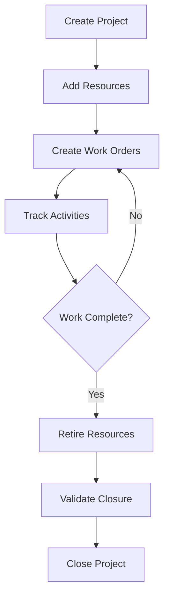

The Project Management feature enables you to create and manage projects for your clients, assign equipment and resources, and track project activities throughout their lifecycle.

## What is a Project?

A Project represents a contracted service engagement with a client (Partner). Each project includes:

- **Client Information**: Associated with a specific Partner (client)
- **Location Details**: Camp location and cardinal point (North, South, East, West, etc.)
- **Contact Information**: On-site contact name and phone number
- **Timeline**: Start date and optional end date
- **Status**: Active (open) or Closed

## Creating a New Project

<Steps>
  <Step title="Navigate to Projects">
    Access the Projects section from the main navigation menu.
  </Step>
  
  <Step title="Select Client">
    Choose the client (Partner) for whom you're creating the project. Each client is identified by their business tax ID (RUC) and company name.
  </Step>
  
  <Step title="Enter Project Details">
    Fill in the following information:
    - **Location**: The camp or site name where work will be performed
    - **Cardinal Point**: Geographic direction (NORTE, SUR, ESTE, OESTE, NORESTE, NOROESTE, SURESTE, SUROESTE)
    - **Contact Name**: Primary on-site contact person
    - **Contact Phone**: Phone number for the on-site contact
    - **Start Date**: When the project begins
    - **End Date**: (Optional) Expected project completion date
  </Step>
  
  <Step title="Save Project">
    Click Save to create the project. The system assigns a unique project ID automatically.
  </Step>
</Steps>

<Note>
  Projects use soft deletion to preserve audit history. When you "delete" a project, it's marked as deleted but remains in the database for historical reference.
</Note>

## Viewing Project Details

The project dashboard displays:

- **Project Information**: All project details including client, location, and contacts
- **Work Orders**: All work order sheets (planillas) associated with the project
- **Custody Chains**: Total number of custody chain records
- **Project Statistics**: 
  - Total work orders
  - Work orders in progress
  - Invoiced work orders
  - Total custody chains

## Managing Project Resources

Once a project is created, you can assign resources (equipment and services) to it:

### Adding Resources to a Project

<Steps>
  <Step title="Select Resources">
    From the project view, click "Add Resources" and browse or search available equipment and services.
  </Step>
  
  <Step title="Configure Resource Details">
    For each resource, specify:
    - **Type**: EQUIPO (Equipment) or SERVICIO (Service)
    - **Detailed Description**: Specific description for this assignment
    - **Physical Equipment Code**: Equipment identifier
    - **Cost**: Rental or service cost
    - **Operation Start Date**: When this resource begins operation
    - **Operation End Date**: (Optional) When resource assignment ends
  </Step>
  
  <Step title="Set Maintenance Frequency">
    Configure how often maintenance should be performed:
    - **By Interval**: Every X days (e.g., every 2 days)
    - **By Week Days**: Specific days of the week (Monday=0, Tuesday=1, etc.)
    - **By Month Days**: Specific days of the month (e.g., 1st, 15th, 28th)
  </Step>
  
  <Step title="Confirm Assignment">
    Save the resource assignment to add it to the project.
  </Step>
</Steps>

<Tip>
  You can assign both equipment (physical assets like treatment plants, bathrooms) and services (like technical support) to a project. Each has different tracking and billing characteristics.
</Tip>

### Retiring Resources

When equipment is no longer needed on a project:

<Steps>
  <Step title="Select Resource">
    Find the resource in the project's resource list.
  </Step>
  
  <Step title="Initiate Retirement">
    Click the "Retire" or "Release" button for the resource.
  </Step>
  
  <Step title="Enter Retirement Details">
    Provide:
    - **Retirement Date**: When the resource was removed
    - **Retirement Reason**: Why the resource was retired (e.g., "Project phase completed", "Equipment malfunction")
  </Step>
  
  <Step title="Confirm Retirement">
    Save the retirement. The resource is marked as retired but remains in project history.
  </Step>
</Steps>

<Note>
  Retiring a resource automatically releases any related services. For example, retiring a treatment plant will also retire its associated maintenance service.
</Note>

## Closing a Project

When all work is complete, you can close the project:

<Steps>
  <Step title="Validate Closure Readiness">
    Click "Close Project" to check if the project can be closed. The system validates:
    - All work orders are in final status (LIQUIDATED, INVOICED, or CANCELLED)
    - All equipment has been properly released
    - All documentation is complete
  </Step>
  
  <Step title="Review Alerts">
    If there are any issues, the system displays alerts indicating what needs to be resolved before closure.
  </Step>
  
  <Step title="Confirm Closure">
    Once validation passes, confirm the project closure. This action:
    - Marks the project as closed (`is_closed = true`)
    - Automatically releases any remaining equipment
    - Updates equipment availability status
    - Finalizes all project records
  </Step>
</Steps>

<Warning>
  Once a project is closed, you cannot add new work orders or make major modifications. Ensure all billing and documentation is complete before closing.
</Warning>

## Project Workflow Summary

## Best Practices

- **Keep contact information updated**: On-site contacts may change during long projects
- **Document resource changes**: Always provide clear retirement reasons for audit purposes
- **Regular status reviews**: Check project statistics regularly to ensure work orders are progressing
- **Coordinate closure**: Communicate with billing and operations teams before closing projects
- **Preserve history**: Never physically delete projects; use the soft delete feature
